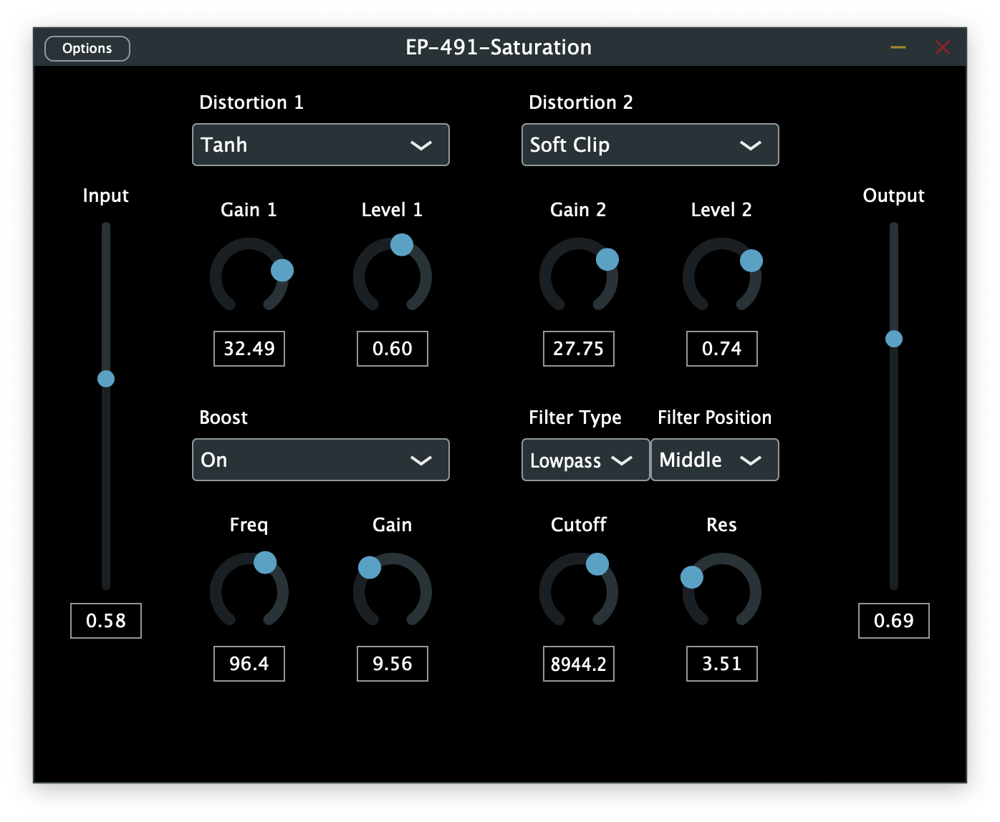

# EP-491-Distortion

## Project Description 

Distortion audio effect plugin in VST3 and AU format, written in C++ and the JUCE framework.

Project for Advanced Projects in Electronic Production and Design (EP-491) at Berklee College of Music.

## Features

* 2 layers of distortion
* 6 algorithm options including Soft Clip, Hard Clip, Diode and Sine Waveshaper
* Gain and level parameters
* Input and output parameters
* SVF filter with cutoff and resonance parameters
* Adjustable filter position 

