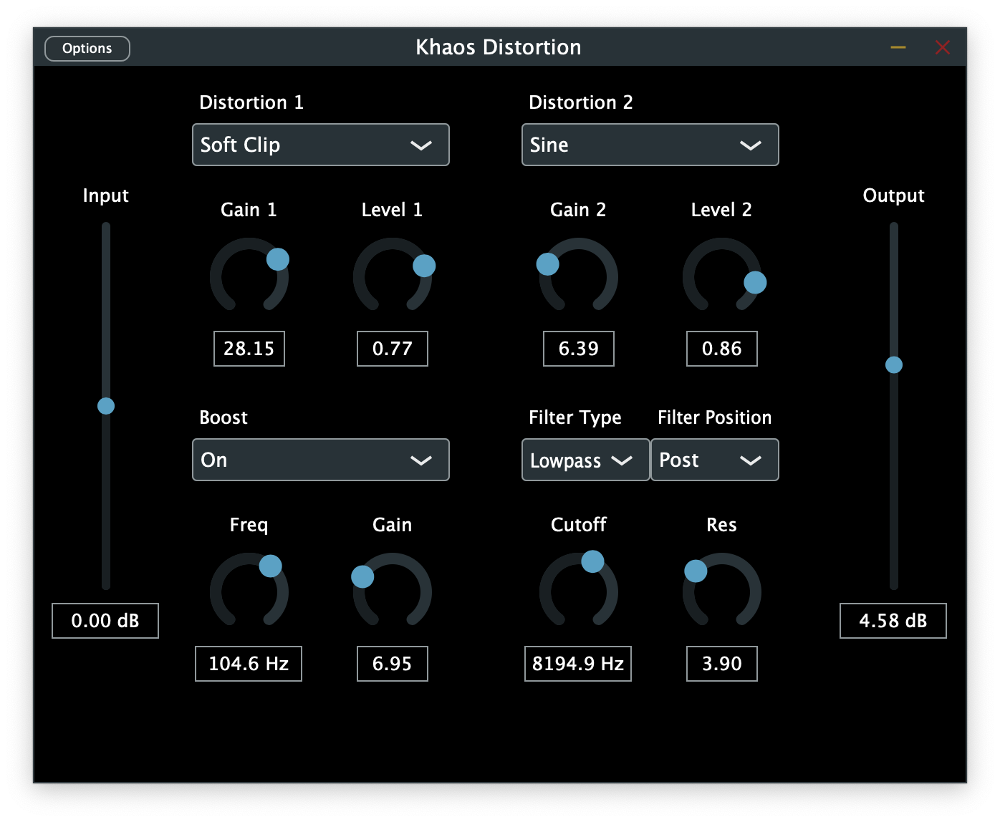

# KhaosDistortion

## Project Description 

Distortion audio effect plugin in VST3 and AU format, written in C++ and the JUCE framework.

Project for Advanced Projects in Electronic Production and Design (EP-491) at Berklee College of Music.

## Features

* 2 layers of distortion
* 6 algorithm options including Soft Clip, Hard Clip, Diode and Sine Waveshaper
* Gain and level parameters
* Input and output parameters
* IIR peak filter to boost low end
* Adjustable cutoff and gain
* SVF filter with cutoff and resonance parameters
* Adjustable filter position 

## Demo

[SoundCloud Link](https://soundcloud.com/user-67320085-103319864/khaos-demo-prod-bvnshee/s-epkrJFqvXtr?si=6e10a66f2a3c452eaf8d29107d2b8d8f&utm_source=clipboard&utm_medium=text&utm_campaign=social_sharing)

## Building

Download the [JUCE framework](https://juce.com/get-juce/) before
cloning this repo. Open "EP-491-Saturation.jucer" and open the source files in your preferred exporter. 

In your IDE, select the plugin format you wish to use, and run the program. The plugin will then be available in the plugins section of your DAW.
